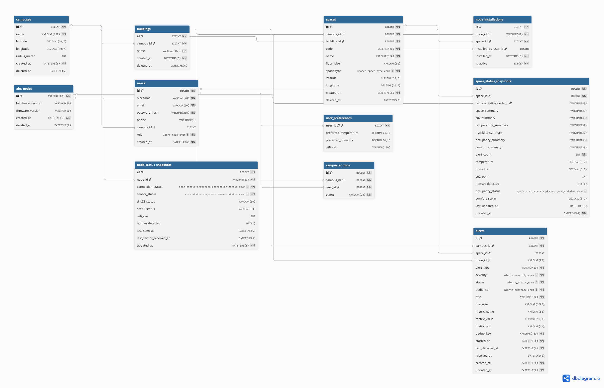

# AIRS Backend

> AIRS 백엔드 서버 프로젝트

## API Docs

### ✨ [AIRS Backend Swagger UI](https://petstore.swagger.io/?url=https://raw.githubusercontent.com/Jhoae/airs-backend/main/openapi.yaml)

현재 백엔드 소스의 기준 저장소는 [`Jhoae/airs-backend`](https://github.com/Jhoae/airs-backend)입니다.
프로젝트 종료 후에는 운영 배포와 CI/CD를 수행하지 않고, 로컬 테스트를 통과한 코드만 개인 저장소에서 관리합니다.

## 기술스택

<p>
  &nbsp;
  &nbsp;
  &nbsp;
  &nbsp;
  &nbsp;
  &nbsp;
  &nbsp;
  &nbsp;
  &nbsp;
  &nbsp;
  &nbsp;
  &nbsp;
</p>

## 개발·실행 환경

| 구분 | 환경 |
|---|---|
| Application | Java 21 · Spring Boot 3.5.13 · Gradle Wrapper |
| Data & Messaging | MySQL 8.4 · InfluxDB 2.7 · Redis 7.4 · Mosquitto 2 |
| Local & Staging | Docker Compose · Caddy 2.8 |

## 시스템 구성도


## ERD



## Usage

```sh
cp .env.example .env
# .env의 DB 비밀번호, InfluxDB token, JWT secret을 변경합니다.
docker compose up -d --build
curl http://localhost:8080/actuator/health

./gradlew test

docker compose down
```
