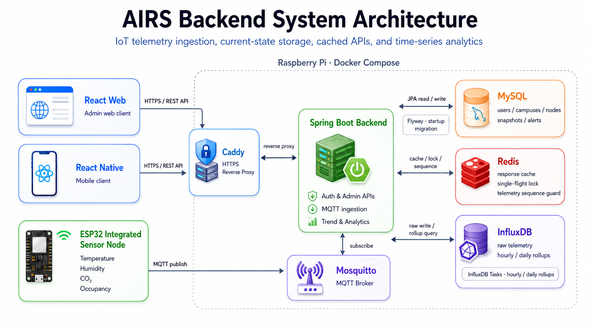

# AIRS Backend

> AIRS 백엔드 서버 프로젝트

## API Docs

### ✨ [AIRS Backend Swagger](https://app.swaggerhub.com/apis-docs/jho-3c0/airs-backend-api/v1?view=uiDocs)

## 기술스택

<p>
  &nbsp;
  &nbsp;
  &nbsp;
  &nbsp;
  &nbsp;
  &nbsp;
  &nbsp;
  &nbsp;
</p>

## 개발환경

- backend
  - Java 21
  - Gradle
  - Spring Boot 3.5.13
- database
  - MySQL
  - InfluxDB
- messaging
  - MQTT Broker

## 시스템 구성도



## Usage


다음 서비스가 먼저 실행 중이어야 합니다.

- MySQL
- InfluxDB
- MQTT Broker

실행 전 application.yaml 값 또는 환경변수를 실행 환경에 맞게 준비해야 합니다.

필수로 확인할 값:

- `DB_URL`
- `DB_USERNAME`
- `DB_PASSWORD`
- `DDL_AUTO`
- `JWT_SECRET`
- `JWT_ACCESS_TOKEN_EXPIRATION_MINUTES`
- `INFLUX_URL`
- `INFLUX_TOKEN`
- `INFLUX_ORG`
- `INFLUX_BUCKET`
- `INFLUX_MEASUREMENT`
- `INFLUX_NODE_ID_TAG`
- `MQTT_HOST`
- `MQTT_PORT`
- `MQTT_TOPIC`

예시 `application.yaml`:

```yaml
spring:
  datasource:
    url: jdbc:mysql://mysql:3306/airs
    username: example_user
    password: example_password

  jpa:
    hibernate:
      ddl-auto: update

jwt:
  secret-key: example-jwt-secret-key
  access-token-expiration-minutes: 30

influx:
  url: http://influxdb:8086
  token: example-influx-token
  org: example-org
  bucket: example-bucket
  measurement: sensor_data
  node-id-tag: node_id

mqtt:
  host: mosquitto
  port: 1883
  topic: airs/node/+/dht22
```

### 서버 실행
```sh
./gradlew bootRun
```

### Docker / Compose 실행

1. 라즈베리파이에 실제 설정 파일 준비

```text
/home/pi/sogangairs/application.yaml
```

2. `application.yaml`에서는 `localhost` 대신 compose 서비스명을 사용

```yaml
spring:
  datasource:
    url: jdbc:mysql://mysql:3306/airs

influx:
  url: http://influxdb:8086

mqtt:
  host: mosquitto
```

3. compose에서 backend 설정 파일을 `/app/config/application.yaml`로 mount

```text
/home/pi/sogangairs/application.yaml:/app/config/application.yaml:ro
```

4. compose로 backend 실행

```sh
docker compose up -d --build backend
```

[//]: # (## ERD)

[//]: # (![AIRS Backend ERD]&#40;docs/erd/backend-erd.png&#41;)
