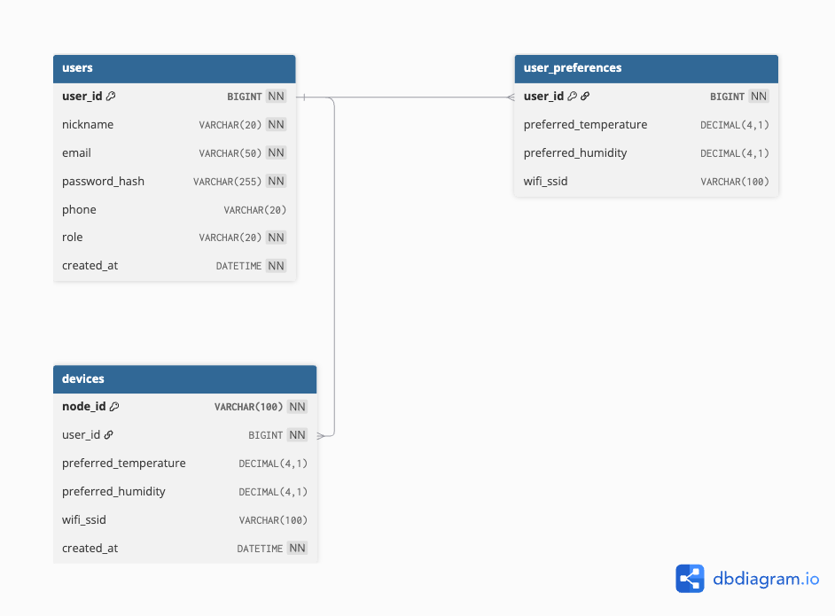

# AIRS Backend

> AIRS 백엔드 서버 프로젝트

## API Docs

### ✨ [AIRS Backend Swagger](https://app.swaggerhub.com/apis-docs/jho-3c0/airs-backend-api/v1?view=uiDocs)

## 기술스택

<p>
  &nbsp;
  &nbsp;
  &nbsp;
  &nbsp;
  &nbsp;
  &nbsp;
  &nbsp;
  &nbsp;
</p>

## 개발환경

- backend
  - Java 21
  - Gradle
  - Spring Boot 3.5.13
- database
  - MySQL
  - InfluxDB
- messaging
  - MQTT Broker

## 시스템 구성도


## Usage

### 서버 실행

다음 서비스가 먼저 실행 중이어야 합니다.

- MySQL
- InfluxDB
- MQTT Broker

실행 전 [application.yaml](/Users/ohjaeho/Desktop/AIRS_sideprj/backend/src/main/resources/application.yaml)에서 사용하는 환경변수를 셸에 먼저 설정해야 합니다.

필수로 확인할 값:

- `DB_URL`
- `DB_USERNAME`
- `DB_PASSWORD`
- `DDL_AUTO`
- `JWT_SECRET`
- `JWT_ACCESS_TOKEN_EXPIRATION_MINUTES`
- `INFLUX_URL`
- `INFLUX_TOKEN`
- `INFLUX_ORG`
- `INFLUX_BUCKET`
- `INFLUX_MEASUREMENT`
- `INFLUX_NODE_ID_TAG`
- `MQTT_HOST`
- `MQTT_PORT`
- `MQTT_TOPIC`

예시 `application.yaml`:

```yaml
spring:
  datasource:
    url: jdbc:mysql://127.0.0.1:3306/airs
    username: example_user
    password: example_password

  jpa:
    hibernate:
      ddl-auto: update

jwt:
  secret-key: example-jwt-secret-key
  access-token-expiration-minutes: 30

influx:
  url: http://localhost:8086
  token: example-influx-token
  org: example-org
  bucket: example-bucket
  measurement: sensor_data
  node-id-tag: node_id

mqtt:
  host: localhost
  port: 1883
  topic: airs/node/+/dht22
```

서버 실행:

```sh
./gradlew bootRun
```

## ERD


